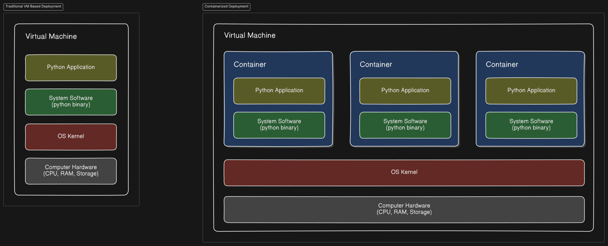

[origin-doc](https://app.eraser.io/workspace/b5XNGBgVVufAwMTf79ci?origin=share)

# Docker Introduction
- This document will help developers to get started with docker & containerization
- Developers with basic knowledge of application deployment.
- Developers will be able build docker images and deploy on servers using docker compose.
# Getting Started with Docker
- Docker is a platform that empowers developers to build, ship, and run applications in lightweight, portable containers. It solves the "it works on my machine" problem by ensuring consistent environments across development, testing, and production.
  
- **What make docker unique from traditional deployment?**
**Ans ->** In traditional deployment applications are deployed on servers which has their own system software and kernel. This whole bundle makes the deployment of application more resource heavy. 
On the other hand docker only packages required system software that is necessary to run the application and for kernel it shares it from the host machine, making it lightweight and portable.



> **Important Note:** Docker is not a container, it's an interface that manages containers. A `Container` is a runtime instance of a `container image`.

---

- Installing Docker on different platforms
    - Windows ([docs.docker.com/desktop/setup/install/windows-install/](https://docs.docker.com/desktop/setup/install/windows-install/) )
    - macOS ([docs.docker.com/desktop/setup/install/mac-install/](https://docs.docker.com/desktop/setup/install/mac-install/) )
    - Linux ([docs.docker.com/engine/install/](https://docs.docker.com/engine/install/) )
> Important Note: For Linux don't use docker desktop. Docker desktop and Docker Engine are different.

# Process
1. Create Dockerfile
2. Build Image with Tags
3. Push Image to docker registry
4. Pull image on server
5. Create container from docker image
# Basic Docker Commands
- Checking Docker version
```bash
docker -v
```
- run hello world docker
```bash
docker run hello-world
```

- List docker containers

```bash
docker ps 
```

- List all docker images
```bash
docker ps -a 
```

- Running Docker containers (e.g. nginx)
```bash
docker run -d -p 80:80 --name nginx-server nginx
```
- **command break down**
  - `docker run`: Start a container.
  - `-d`: Run in background.
  - `-p 80:80`: Map host port 80 to container port 80.
  - `--name nginx-server`: Name the container "nginx-server".
  - `nginx`: Use the Nginx image.

- Stopping and removing containers

```bash
docker stop nginx-server
docker rm nginx-server
```

# Creating Docker Images
- A Dockerfile is a text document containing instructions to build a Docker image. It automates the process of creating a consistent environment for your application, specifying the base image, dependencies, and configuration. Think of it as a recipe for your container.
- Writing a simple Dockerfile (sample project: [github.com/Amansinghtech/drf-practice.git](https://github.com/Amansinghtech/drf-practice.git) )

```Dockerfile
# Light weight Docker image that runs python 3.8
FROM python:3.12 AS base

# PYTHONUNBUFFERED ENV : Runs python in unbuffred mode as recommended when
# running python with in Docker container (It doesn't allow python to buffer
# the outputs it just prints them directly. P.S : Makes it easire to debug and
# run python application)
ENV PYTHONUNBUFFERED=1
ENV PYTHONDONTWRITEBYTECODE=1

# Update OS
RUN apt-get update
#RUN apt-get install -y wget

RUN apt-get install -yyq build-essential libffi-dev fonts-indic xvfb
# installing wkhtmltopdf
#RUN wget https://github.com/wkhtmltopdf/packaging/releases/download/0.12.6-1/wkhtmltox_0.12.6-1.bionic_amd64.deb
#RUN dpkg -i wkhtmltox_0.12.6-1.bionic_amd64.deb; apt-get install -y -f
# RUN apt-get install wkhtmltopdf

RUN pip install --upgrade pip

# run Xvfb screen
#RUN Xvfb :1 -screen 0 1920x1080x24+32 -fbdir /var/tmp & export DISPLAY=:1

# Cleaning up unused files
RUN apt-get purge -y --auto-remove -o APT::AutoRemove::RecommendsImportant=false && rm -rf /var/lib/apt/lists/*


FROM base AS pacakges

# Setting up app dir as default dir
WORKDIR /app

# Copy Requirements from adjacent directory to the docker image
COPY ./requirements.txt requirements.txt
# Install Requirements onto docker image
RUN pip install -r requirements.txt


FROM pacakges AS server

COPY . .
# Create a user ( specifying that this user is
# only going to be used for running applications/processes -D for not using password)
RUN adduser --disabled-login user
# Switching to created user with limited scope (P.S: If we don't switch the user them image
# will run out application using root account which is not recommended)
USER user

RUN python manage.py  migrate --no-input
#RUN python manage.py collectstatic --no-input

EXPOSE 8000

CMD ["gunicorn", "--bind", ":8000", "--workers", "6", "--timeout", "300", "myproject.wsgi"]
```

- Building and tagging Docker images

```bash
docker build . -t drf-pracice
```

- Best practices for image creation
    - Always use stages to build image
    - add .dockerignore 
    - add versioning to tags before pushing

# Managing Docker Images

- Listing images
```bash
docker images
```

- remove image
```bash
docker rmi <imagename>
```

- remove dangling images
```bash
docker image prune
```

- clean build cache
```bash
docker builder prune
```

- Pushing images to Docker Hub
```bash
docker push <image-name>
```

- Pulling images from repositories
```bash
docker pull <image-name>
```

# Docker Compose
create docker compose file with nginx config and mysql database

sample `nginx.conf` 

```nginx
events {}

http {
    upstream django {
        server web:8000;
    }

    server {
        listen 80;

        location / {
            proxy_pass http://django;
            proxy_set_header Host $host;
            proxy_set_header X-Real-IP $remote_addr;
            proxy_set_header X-Forwarded-For $proxy_add_x_forwarded_for;
            proxy_set_header X-Forwarded-Proto $scheme;
        }

        location /static/ {
            alias /app/static/; #adjust to your static folder.
        }
    }
}
```

sample docker-compose file.

```yaml
version: "3.8"
services:
  web:
    image: drf-practice:latest # Replace with your Django image
    ports:
      - "8000:8000"
    environment:
      DJANGO_DEBUG: "true"

  nginx:
    image: nginx:latest
    ports:
      - "80:80"
    volumes:
      - ./nginx.conf:/etc/nginx/nginx.conf
    depends_on:
      - web
```

- start docker-compose
```bash
docker-compose up
```

- start docker-compose in background
```bash
 docker-compose up -d
```

- stop docker-compose
```bash
docker-compose down
```

- log docker-compose
```bash
docker-compose logs -f
```

sample `docker-compose.yaml` with image build

```yaml
version: "3.8"
services:
  web:
    image: drf-practice:latest # Replace with your Django image
    build:
      context: .
      dockerfile: Dockerfile
    ports:
      - "8000:8000"
    environment:
      DJANGO_DEBUG: "true"

  nginx:
    image: nginx:latest
    ports:
      - "80:80"
    volumes:
      - ./nginx.conf:/etc/nginx/nginx.conf
    depends_on:
      - web
```

- compose up with build
```bash
docker-compose up --build
```

- pull new images from docker-compose
```bash
docker-compose pull
```
# Further Learning
- Try adding a database using docker-compose (managing volumes)
- Try customizing network in docker-compose


